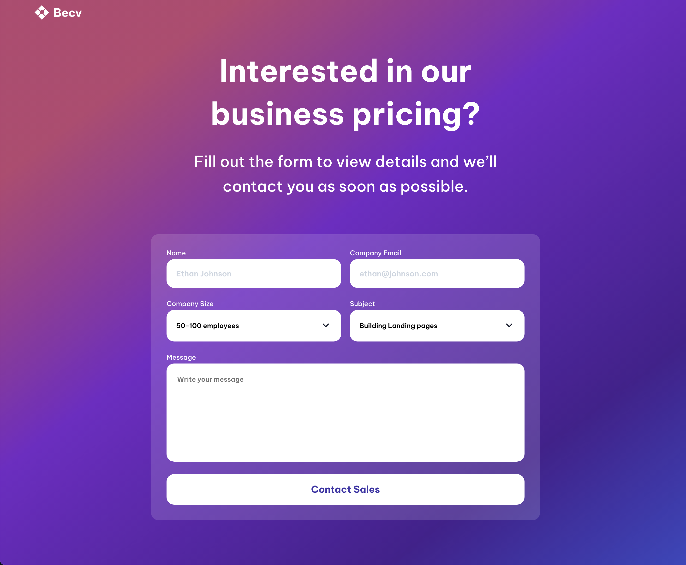

# My Task Board

This is a solution to the My Task Board on [devChallenges.io](https://devchallenges.io).

## Table of contents

- [Overview](#overview)
  - [Screenshot](#screenshot)
  - [Links](#links)
- [My process](#my-process)
  - [Built with](#built-with)
  - [Explanation](#explanation)
- [Credits](#credits)

## Overview

### Screenshot

This is a screenshot of the final view of the project.

### Links

- Solution URL: [https://github.com/thejxylog/contact-page-react](https://github.com/thejxylog/contact-page-react)
- Live Site URL: [https://contact-page-react-jayl.vercel.app/](https://contact-page-react-jayl.vercel.app)

## My process

### Built with

- React.js
- Styled components
- React Hook Form

### Explanation

Used semantic HTML5 elements, Styled components for the design and validated form data with React Hook Form library. Select options(dropdown) are custom made which works with the help of useState. Form will be reset when submitted, and since it's just about building the form itself, the data won't be stored anywhere.

## Credits

- Challenge site - [devChallenge.io](https://devchallenges.io/challenge/contact-page)
- Author - [Thu Nghiem](https://devchallenges.io/profile/ff6a2335-b279-4601-8927-85c85af7e7d8)
